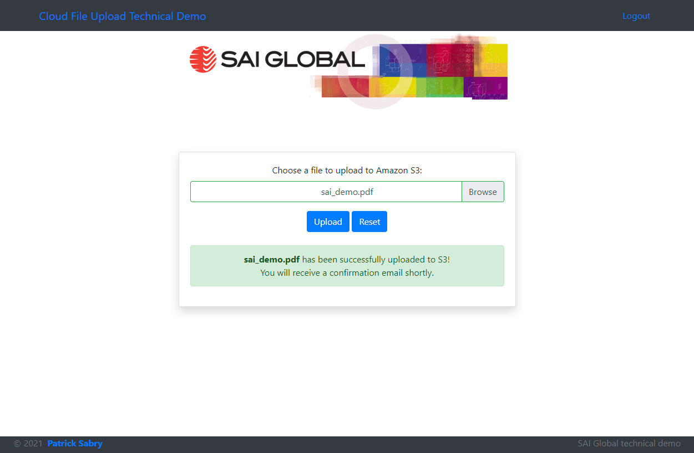
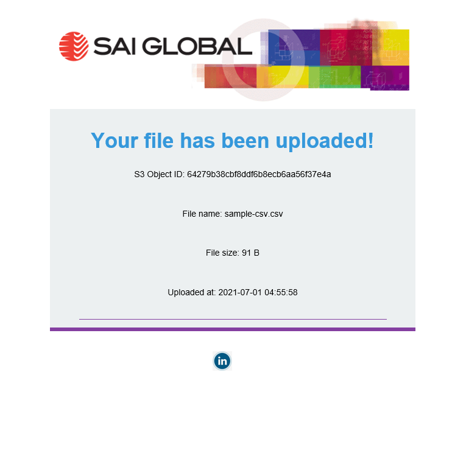

# Cloud filesystem app demo

## Author
- Patrick Sabry
## Stack
- Laravel 8
- Vue JS 2/Nuxt JS framework
- Bootstrap
- MySQL 8
- AWS RDS
- AWS S3

## Solution architecture notes
- Microservice based design, major streams of business logic decoupled into independent, highly modifiable services.
- Robust token-based user authentication strategy implemented via middleware.
- S3 integration done directly through laravel middleware.
- Third party email integration done through laravel Mail fascade using SMTP.
- Data model normalised including relationship table for user-file association.

## Improvements to be made
- Leverage SQS/database queue to decouple email send process from the file upload process. Email send job should be pushed to queue and processed asynchronously to minimise load time on frontend and enhance UX.
- Build out more functionality for S3 bucket/file management, including programmatically choosing/creating specific bucket for upload.
- Build out email service to use an enterprise grade API based email send service instead of SMTP. 

## Architecture Diagram

## Demo Screenshots
### 1. Login Page

### 2. File Upload Page

### 3. Successful File Upload

### 4. Failed File Upload

### 5. Email Notification

### 6. Files table in database
